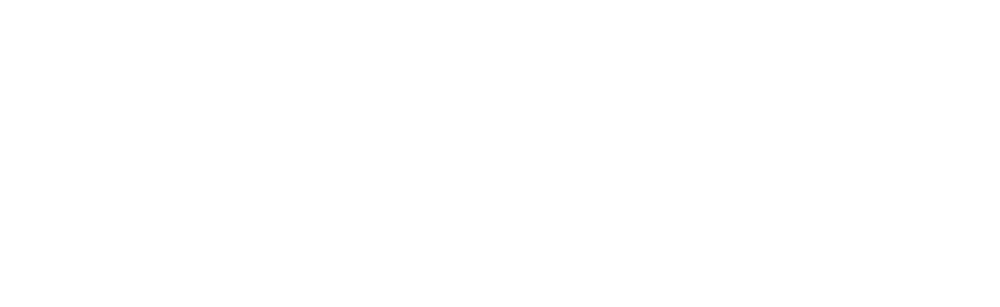

# MERA Code

<p align="center">
  <picture>
    <source media="(prefers-color-scheme: dark)" srcset="docs/mera-code-logo-white.png">
    <source media="(prefers-color-scheme: light)" srcset="docs/mera-code-logo-black.svg">
    
  </picture>
</p>

<p align="center">
    <a href="https://opensource.org/licenses/MIT">
    
    </a>
    <a href="https://github.com/MERA-Evaluation/MERA_CODE/tree/main">
    
    </a>

</p>

<h2 align="center">
    <p> MERA Code: A Unified Framework for Evaluating Code Generation Across Tasks.
</p>
</h2>

## 🚀 About

**MERA Code** brings together a rich collection of code-focused evaluation tasks—both private and public—under one roof. Built on top of the [Language Model Evaluation Harness](https://github.com/EleutherAI/lm-evaluation-harness) (v0.4.8), it enables researchers and practitioners to:

- **Compare models** on identical tasks and metrics
- **Reproduce results** with fixed prompts and few-shot settings
- **Submit** standardized ZIP archives for leaderboard integration


## 🔍 Datasets Overview

| Set         | Task Name          | Language                         | Metrics                        | Size | Prompts | Skills                                                        |
| ----------- | ------------------ | -------------------------------- | ------------------------------ | ---- | ------- | ------------------------------------------------------------- |
| **Private** | **ruCodeEval**     | Python                           | pass@k                         | 164  | 10      | Instruction Following, Code Perception, Completion, Algorithms & Data Structures |
|             | **RuCodeReviewer** | Java, Scala, Go, Python          | Judge@k, BLEU, chrF            | 689  | 10      | Instruction Following, Code Perception, Review, Simulation, Explanation, Design Patterns, Style Guides |
|             | **CodeLinterEval** | Python                           | pass@k                         | 110  | 10      | Instruction Following, Code Perception, Style Guides, Review, Editing |
| **Public**  | **ruHumanEval**    | Python                           | pass@k                         | 164  | 10      | Instruction Following, Code Perception, Completion            |
|             | **StRuCom**        | Python, Java, Go, C#, JavaScript | chrF                           | 500  | 10      | Instruction Following, Code Perception, Simulation, Documentation |
|             | **UnitTests**      | Python, Java, Go, C#, JavaScript | CodeBLEU                       | 2500 | 20      | Instruction Following, Code Perception, Synthesis, Testing, Long Context Comprehension |
|             | **CodeCorrectness**| Python, Java, Go                 | EM                             | 1361 | 11      | Instruction Following, Code Perception, Simulation, Error Classification |
|             | **RealCode**       | Python                           | pass@k                         | 802  | 10      | Instruction Following, Code Perception, Completion            |
|             | **RealCodeJava**   | Java                             | pass@k                         | 298  | 10      | Instruction Following, Code Perception, Completion            |
|             | **JavaTestGen**    | Java                             | pass@k, compile@k              | 227  | 10      | Instruction Following, Code Perception, Completion, Testing   |
|             | **YABLoCo**        | C, C++                           | pass@k, EM                     | 208  | 11      | Instruction Following, Code Perception, Completion,  Long Context Comprehension    |


## 🛠 Getting Started

 
There are two evaluation regimes:
1. **Remote Scoring** (default): quick setup for cloud-based scoring — install only core dependencies, run the evaluation, and submit resulting ZIP-archive to our website to get the score. 
2. **Local Scoring** (optional): full setup for on-premise evaluation — install extra dependencies with metrics and runing Docker containers. Available only for Public sets. Make sure you have a stable internet connection, enough disk space, and CPU resources.


```bash
### Go to the folder where the repository will be cloned ###
mkdir mera_code
cd mera_code

### Clone & install core libs ###
git clone --recurse-submodules https://github.com/MERA-Evaluation/MERA_CODE.git
cd MERA_CODE/lm-evaluation-harness
pip install -e .

### Install additional libs for models evaluation [Optional] ###
# vLLM engine
pip install -e ".[vllm]"
# API scoring
pip install -e ".[api]"

### Go to MERA_CODE folder ###
cd ../

### Install libs for Local Scoring only usage [Optional] ###
# Install code_bleu metric for UnitTests
git clone https://github.com/Pstva/code_bleu.git
cd code_bleu
pip install -e .
# Install metrics for YABLoCo
cd ..
mkdir workspace
cd workspace
git clone -b mera_code https://github.com/yabloco-codegen/yabloco-benchmark

### Run evaluation and pack logs ###
bash scripts/run_evaluation.sh --model vllm --model_args "pretrained=Qwen/Qwen2.5-0.5B-Instruct,tensor_parallel_size=1"
```

## 📁 Repository Structure

```text
MERA_CODE/
├── code_tasks/                     # Code for each task
├── datasets/                       # Task descriptions, metadata, readme
├── docs/                           # Additional documentation and design notes
    ├── templates                   # Templates of tasks readme
    ├── dataset_contribution.md     # How to add a new dataset into MERA Code
    ├── dataset_criteria.md         # Creteria to add new dataset into MERA Code
    ├── dataset_formatting.md       # Dataset formatting requirements
    ├── dataset_hf.md               # How to add new datasets on MERA HuggingFace page
    ├── dataset_review.md           # General dataset requirements
    ├── model_scoring.md            # How to use lm-eval to evaluate the LMs
    ├── task_codebase.md            # How to add a new task into codebase
    ├── MERA_code_tax.png           # Taxonomy of coding skills
├── lm-evaluation-harness/          # Submodule (codebase)
└── scripts/                        # Helpers: add tasks, run evaluations, scoring
```


## 🤝 Contributing

We are interested in improvement of MERA Code and inviting the community to contribute to the development of new complex tasks and the project’s codebase. 

### Steps to Add a New Task:  
0) Develop a dataset (on the contributor’s side; see [task requirements](docs/dataset_review.md))  
1) Convert the dataset to MERA format ([guide](docs/dataset_formatting.md))  
2) Upload the dataset to 🤗HF Hub ([guide](docs/dataset_hf.md))  
3) Submit the dataset for MERA organizer review ([guide](docs/dataset_hf.md))  
4) Write evaluation code using lm-harness ([guide](docs/task_codebase.md))  
5) Benchmark state-of-the-art baseline models on the dataset 
6) Final moderation and your dataset is officially added!
   
## 📝 License

Distributed under the MIT License. See LICENSE for details.

